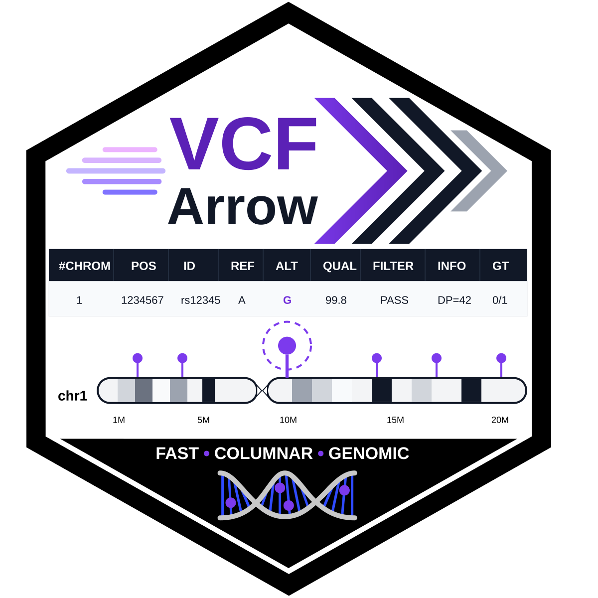

# VCFArrow 

# Installation

This package needs to be installed from GitHub.
`devtools::install_github("legalLab/VCFArrow")`

The package is build around Apache Arrow (<https://arrow.apache.org/>).
The Apache Arrow libarrow-dev, libparquet-dev, libarrow-dataset-dev, and
libarrow-acero-dev libraries need to be installed. Installation
instruction are found here (<https://arrow.apache.org/install/>).

# Introduction

This package has six main functionalities: (1) reading in and writing
out VCF data files, including precalculation of diverse metrics used in
the filtering functions; (2) data filtering functions; (3) merging VCFs;
(4) subsetting VCFs; (5) generation of summary statistics and graphs;
and (6) data transformation and writing out of other data formats (
population genetic and phylogenetic formats) for downstream analyses.
This package is a reimagination of the `vcf2others` package. Same as
`vcf2others`, it uses the Apache Arrow library functions to manipulate
SNP data via dplyr verb equivalents. However, unlike `vcf2others`,
`VCFArrow` now reads in the VCF data file into an S4 R object
constructed around an Apache Arrow data structure. It precalculate a
number of metrics and stores them in the S4 object. The VCF genotype
matrix is stored as a long tidy table, and the data in the S4 object are
lazy loaded. Many common tasks have been delegated to shared, C++ backed
APIs and functions. These modifications and optimizations now permit
extremely fast data filtering, manipulation and transformation. It is
possible to process VCFs comprising tens of millions of SNVs and
hundreds of individuals in matter minutes with minimal RAM overhead.

## Meta

- Please [report here any issues or bugs or
  suggestions](https://github.com/legalLab/VCFArrow/issues).
- License: MIT.
- Get citation information for `VCFArrow` in R by running
  `citation(package='VCFArrow')`.

# How to use the functions of this package

Following are examples of the usage of the functions of this package.

## Load VCF and associated files of individuals and groups

First we need to read in the VCF. If one has information on the grouping
of individuals, this information can also be put into the VCFArrow
object. This grouping information is stored in a ‘strata’ file (a
tab-separated text file with two columns with an ‘id’ and ‘pop’
headers). The grouping of individuals can be used in filtering steps,
and it is necessary for transformation of the VCFArrow object to other
population genetic formats, many of which require it.

The data used in this example are from Mota et al. (2026)—a population
genomic analysis of the *Phyllomedusa vaillantii* species complex. The
original dataset has 18579683 SNVs by 56 samples. For the purpose of
this tutorial, the dataset was randomly subsampled to 10000 SNVs by 18
samples (five samples by three main lineages of *Phyllomedusa
vaillantii* as ingroups, plus three samples of *Phyllomedusa bicolor*
included as outgroups).

``` r

library(VCFArrow)
library(dplyr)

# set path to example files and project name
data_path <- system.file("extdata", package="VCFArrow")
project <- "vaillantii_"
postfix <- "discosnp_sub"

# load vcf and assign individuals to groups based on 'strata'
vcf <- read_vcf(file.path(data_path, paste0(project, postfix, ".vcf.gz"))) |>
  set_vcf_groups(data_path)
#> ℹ VCF is being read in chunks of 50000 variants
#> ✔ VCF successfully read into a VCFArrow object

# visualize the VCFArrow object
vcf
#> 
#> An object of class "VCFArrow"
#> 
#> Dimensions:
#>   Variants: 10000 
#>   Samples:  18 
#> 
#> Quick stats:
#>   Non-missing variants: 10000 
#> 
#> Phased genotypes: FALSE 
#> 
#> Storage:
#>   Path: /tmp/Rtmp486OmM/arrow_vcf_2e60323efd2ad 
#> 
#> Genotype storage (Arrow):
#> FileSystemDataset with 1 Feather file
#> 9 columns
#> .row_id: int32
#> sample: string
#> a1: int32
#> a2: int32
#> phased: bool
#> fmt: string
#> DP: double
#> GQ: double
#> ADR: double
#> 
#> See $metadata for additional Schema metadata
#> 
#> Variants (first 5 rows):
#>                     CHROM POS        ID REF ALT QUAL FILTER Rk n_alt is_biallelic is_indel
#> 1 SNP_higher_path_9994239  41 9994239_1   C   G    .      .  1     1         TRUE    FALSE
#> 2 SNP_higher_path_9984432 105   9984432   C   T    .      .  1     1         TRUE    FALSE
#> 3 SNP_higher_path_9967574  50   9967574   A   C    .      .  1     1         TRUE    FALSE
#> 4  SNP_higher_path_993510  88  993510_4   A   G    .      .  1     1         TRUE    FALSE
#> 5 SNP_higher_path_9803974  33   9803974   A   G    .      .  1     1         TRUE    FALSE
#>   .row_id
#> 1       1
#> 2       2
#> 3       3
#> 4       4
#> 5       5
#>   ... 9995 more
#> 
#> INFO (first 5):
#> [1] "Ty=SNP;Rk=1.0;UL=11;UR=8;CL=11;CR=27;Genome=.;Sd=.;Cluster=20022615;ClSize=3"
#> [2] "Ty=SNP;Rk=1.0;UL=3;UR=1;CL=75;CR=7;Genome=.;Sd=.;Cluster=17296599;ClSize=1"  
#> [3] "Ty=SNP;Rk=1.0;UL=20;UR=4;CL=20;CR=4;Genome=.;Sd=.;Cluster=18266172;ClSize=3" 
#> [4] "Ty=SNP;Rk=1.0;UL=1;UR=0;CL=1;CR=0;Genome=.;Sd=.;Cluster=16400006;ClSize=2"   
#> [5] "Ty=SNP;Rk=1.0;UL=3;UR=7;CL=3;CR=7;Genome=.;Sd=.;Cluster=10880986;ClSize=5"   
#> 
#> FORMAT (first 5):
#>           FORMAT .row_id
#> 1 GT:DP:PL:AD:HQ       1
#> 2 GT:DP:PL:AD:HQ       2
#> 3 GT:DP:PL:AD:HQ       3
#> 4 GT:DP:PL:AD:HQ       4
#> 5 GT:DP:PL:AD:HQ       5
#> 
#> Samples (first 5):
#> [1] "Pv120" "Pv126" "Pv13"  "Pv14"  "Pv27" 
#>   ... 13 more

# read individuals to include
# if indivs is blank, the default is to use all individuals
indivs <- read.table(file.path(data_path, "indivs_b"), header = TRUE)$id
  
# check if all samples are in VCF sample names
if (any(!(indivs %in% vcf@samples))) stop(paste("Some individuals in list not in VCF"))
```

## Assessment of missing data

The function
[`assess_vcf_missing_data()`](https://legallab.github.io/VCFArrow/reference/assess_vcf_missing_data.md)
is used to generate a table and graph of missing data for each sample in
a VCFArrow object, while the
[`assess_vcf_coverage()`](https://legallab.github.io/VCFArrow/reference/assess_vcf_coverage.md)
generates a violin plot of read depths of each sample. Both are useful
for visualizing data before and after filtering to evaluate the effect
of filtering. The functions accept parameters which form part of the
name of the output file. The idea is that the output file name contains
information on the name of the project (project), how the VCF was
extracted (postfix), and how it was filtered (fltr). The ‘postfix’ and
‘fltr’ can be left blank if the VCF name does not contain this
information. Samples are ordered and colored by group assignment. The
‘details’ flag specifies whether or not filtering information is
presented in the figure or if only the species name is reported. The
default is to report species name and details.

``` r

# define results path
res_path <- data_path
# species for plot title
species <- "Phyllomedusa vaillantii"
# filter - filter parameters in file name
fltr <- ""

assess_vcf_missing_data(vcf, res_path, species, paste0(project, postfix, fltr))
assess_vcf_coverage(vcf, res_path, species, paste0(project, postfix, fltr))
```

## Basic stats for individuals in VCF

The function
[`vcf_stats()`](https://legallab.github.io/VCFArrow/reference/vcf_stats.md)
is used to generate a table with basic stats for each sample in the
VCFArrow object. These stats include per sample average read depth,
heterozygosity, number of heterozygotes, homozygotes, REF homozygotes
and ALT homogygotes, percent missing SNVs, total missing SNVs, total
non-missing SNVs and total SNVs, Watterson’s Theta and Pi for the entire
dataset, and per group Watterson’s Theta and Pi, plus the number of
individuals in each group. The calculation of Watterson’s Theta and Pi
can be included or excluded based on the ‘theta’ flag.

``` r

# get a table of basic sample stats, including Watterson's Theta and Pi

vcf_stats(vcf, res_path, paste0(project, postfix, fltr), theta = TRUE)
#> ℹ Computing per-sample stats: 10000 variants x 18 samples, reading 1 chunk(s) directly
#> ℹ Accumulating theta/pi: 9313 variants x 4 pops (0 MiB raw storage, vs 0 MiB with integer matrices)
```

## Filtering, subsetting, merging and otherwise wrangling VCF files

Most but not all functions can be used by the user directly on the
`VCFArrow` object. Some functions, such as
[`.vcf_filter_rows()`](https://legallab.github.io/VCFArrow/reference/dot-vcf_filter_rows.md)
and
[`.vcf_filter_columns()`](https://legallab.github.io/VCFArrow/reference/dot-vcf_filter_columns.md)
are common APIs used by other functions to perform filtering. Other
functions, such as
[`vcf_filter_invariant()`](https://legallab.github.io/VCFArrow/reference/vcf_filter_invariant.md)
will remove invariant SNPs from a VCFArrow object; however, VCF by
definition should not have invariant SNPs. So this function is primarily
called by other functions to remove loci that may have become invariant
following filtering.

### Subsetting samples and variants

There are two types of subsetting functions. The first type is used to
subset the VCFArrow object by specific samples
[`vcf_extract_samples()`](https://legallab.github.io/VCFArrow/reference/vcf_extract_samples.md)
or groups (all samples of a group) of samples
[`vcf_extract_groups()`](https://legallab.github.io/VCFArrow/reference/vcf_extract_groups.md).
The ‘keep’ flag in both functions determines whether the indicated
samples should be extracted from the VCF (‘keep = TRUE’) or excluded
from the VCF (‘keep = FALSE’). Once subsetted, the invariant SNVs are
removed by default, however, this behavior is controlled by the
‘f_invar’ flag. The second type subsets a random number of SNVs from the
VCF. The subsetting is done either across the entire VCF
[`vcf_sub_SNVs()`](https://legallab.github.io/VCFArrow/reference/vcf_sub_SNVs.md)
or proportionately within each chromosome/linkage group
[`vcf_sub_SNVs_stratified()`](https://legallab.github.io/VCFArrow/reference/vcf_sub_SNVs_stratified.md).
For repeatability, both functions accept a ‘seed’; if ‘seed’ is not
specified, it is randomly generated.

``` r

# subset VCF by individuals (default keep = TRUE, remove invariants f_invar = TRUE)
indivs1 <- c("Pv14", "Pv27", "Pv28", "Pv78", "Pv126")
vcf1 <- vcf_extract_samples(vcf, indivs1)
#> ℹ Applying invariant filter
#> ℹ Removed 7220 invariant variants; 2780 retained.
#> ℹ Removed samples: Pv120, Pv13, Pv2, Pv31, Pv56, Pv62, Pv68, Pv73, Pv79, Pv93, Pb2Jp, Pb2Scx, and Pb1Rd
#> ℹ Variants retained: 2780 | Samples retained: 5

# subset VCF by groups (default keep = TRUE, remove invariants f_invar = TRUE)
groups1 <- c("GS", "BS", "WA")
vcf1 <- vcf_extract_groups(vcf, groups1)
#> ℹ Applying invariant filter
#> ℹ Removed 1705 invariant variants; 8295 retained.
#> ℹ Removed samples: Pb2Jp, Pb2Scx, and Pb1Rd
#> ℹ Variants retained: 8295 | Samples retained: 15

# subset VCF by a random  number of variants (default n_SNVs = 10000)
vcf1 <- vcf_sub_SNVs(vcf, n_SNVs = 5000)

# subset VCF by a random  number of variants proportional to chromosome length (default n_SNVs = 10000)
# should be used when SNVs are mapped to chromosomes or scaffolds
vcf1 <- vcf_sub_SNVs_stratified(vcf, n_SNVs = 5000)
```

### Filtering

Filtering consists of removing samples and variants based on specific
properties. The function
[`vcf_filter_missing()`](https://legallab.github.io/VCFArrow/reference/vcf_filter_missing.md)
is the only function that filters samples based on % missing SNV
threshold. The other functions filter on properties of individuals SNVs
across samples. The function
[`vcf_filter_missingness()`](https://legallab.github.io/VCFArrow/reference/vcf_filter_missingness.md)
removes SNVs above a % missing threshold,
[`vcf_filter_quality()`](https://legallab.github.io/VCFArrow/reference/vcf_filter_quality.md)
removes SNVs below a quality threshold,
[`vcf_filter_pass()`](https://legallab.github.io/VCFArrow/reference/vcf_filter_pass.md)
removes SNVs that did not PASS filters,
[`vcf_filter_maf()`](https://legallab.github.io/VCFArrow/reference/vcf_filter_maf.md)
removes SNVs with minor allele frequency below a % threshold,
[`vcf_filter_hets()`](https://legallab.github.io/VCFArrow/reference/vcf_filter_hets.md)
removes SNVs with heterozigosity above a % threshold,
[`vcf_filter_rank()`](https://legallab.github.io/VCFArrow/reference/vcf_filter_rank.md)
removes SNPs with rank below a % threshold (rank is specific to VCFs
generated by DiscoSnpRad and measures the likelihood of observed SNP
variation being due to paralogs),
[`vcf_filter_adr()`](https://legallab.github.io/VCFArrow/reference/vcf_filter_adr.md)
either removes (make genotype missing) or corrects (make genotype
homozygous) genotypes with allele ratio imbalance,
[`vcf_filter_coverage()`](https://legallab.github.io/VCFArrow/reference/vcf_filter_coverage.md)
removes SNVs below a specific coverage (make genotypes missing), and
[`vcf_filter_biallelic()`](https://legallab.github.io/VCFArrow/reference/vcf_filter_biallelic.md)
removes all variants that are not biallelic. Finally the
[`vcf_filter_invariant()`](https://legallab.github.io/VCFArrow/reference/vcf_filter_invariant.md)
removes invariant SNVs (SNVs may become invariant after subsetting and
filtering). The function
[`vcf_filter_indels()`](https://legallab.github.io/VCFArrow/reference/vcf_filter_indels.md)
removes indels from the VCF, retaining only SNPs. The functions
[`vcf_filter_oneSNV()`](https://legallab.github.io/VCFArrow/reference/vcf_filter_oneSNV.md)
and
[`vcf_filter_multiSNV()`](https://legallab.github.io/VCFArrow/reference/vcf_filter_multiSNV.md)
filter the VCF to remove linked SNVs (retain only unliked SNPs) or
retain only linked SNVs, respectively. In general, all analyses assume
that SNVs are unlinked, however, some analyses such as FineRadStructure
work with linked SNVs.

``` r

# filter VCF for analyses (unlinked SNPs)
vcf_oneSNP <- vcf_extract_samples(vcf, indivs) |>
  vcf_filter_indels() |>
  vcf_filter_biallelic() |>
  vcf_filter_maf(.03) |>
  vcf_filter_coverage(10) |>
  vcf_filter_missingness(.2) |>
  vcf_filter_missing(.3) |>
  vcf_filter_oneSNV()
#> ℹ No samples to keep or remove - keeping all samples
#> ℹ Applying indel filter
#> ℹ Retained 10000 / 10000 variants (non-Indels)
#> ℹ Applying biallelic filter
#> ℹ Retained 9313 / 9313 variants (biallelic SNVs)
#> ℹ Applying MAF filter
#> ℹ Retained 9069 / 9313 variants (MAF >= 0.03)
#> ℹ Applying read coverage filter
#> ℹ Retained 5171 / 9069 variants (polymorphic with DP >= 10)
#> ℹ Applying locus missingness filter
#> ℹ Retained 1734 / 5171 variants (per-variant missingness <= 0.2)
#> ℹ Applying sample missingness filter
#> ℹ Applying invariant filter
#> ℹ Variants retained: 1734 | Samples retained: 18
#> ℹ Applying unlinked SNV filter

# see how many variants remained
nrow(vcf_oneSNP@variants)
#> [1] 1734

# filter VCF for analyses (linked SNPs)
vcf_multiSNP <- vcf_extract_samples(vcf, indivs) |>
  vcf_filter_indels() |>
  vcf_filter_biallelic() |>
  vcf_filter_maf(.03) |>
  vcf_filter_coverage(10) |>
  vcf_filter_missingness(.2) |>
  vcf_filter_missing(.3) |>
  vcf_filter_multiSNV()
#> ℹ No samples to keep or remove - keeping all samples
#> ℹ Applying indel filter
#> ℹ Retained 10000 / 10000 variants (non-Indels)
#> ℹ Applying biallelic filter
#> ℹ Retained 9313 / 9313 variants (biallelic SNVs)
#> ℹ Applying MAF filter
#> ℹ Retained 9069 / 9313 variants (MAF >= 0.03)
#> ℹ Applying read coverage filter
#> ℹ Retained 5171 / 9069 variants (polymorphic with DP >= 10)
#> ℹ Applying locus missingness filter
#> ℹ Retained 1734 / 5171 variants (per-variant missingness <= 0.2)
#> ℹ Applying sample missingness filter
#> ℹ Applying invariant filter
#> ℹ Variants retained: 1734 | Samples retained: 18
#> ℹ Applying linked SNV filter

# see how many variants remained
nrow(vcf_multiSNP@variants)
#> [1] 0
```

### Extracting and binding

The functions `vcf_merge_bind()`,
[`vcf_bind_sparse()`](https://legallab.github.io/VCFArrow/reference/vcf_bind_sparse.md),
[`vcf_extract_samples()`](https://legallab.github.io/VCFArrow/reference/vcf_extract_samples.md)
and
[`vcf_extract_groups()`](https://legallab.github.io/VCFArrow/reference/vcf_extract_groups.md)
are used to merge two or more VCFArrow objects, and to extract
samples/groups of samples from a VCFArrow objects storing them in a
separate VCFArrow object.

``` r

# extract individuals from VCFArrow object (keep all loci)
indivs1 <- c("Pb2Jp", "Pb2Scx", "Pb1Rd")
vcf_outgrp <- vcf_extract_samples(vcf, indivs1, f_invar = FALSE)
#> ℹ Removed samples: Pv120, Pv126, Pv13, Pv14, Pv27, Pv28, Pv2, Pv31, Pv56, Pv62, Pv68, Pv73, Pv78, Pv79, and Pv93
#> ℹ Variants retained: 10000 | Samples retained: 3
vcf_ingrp <- vcf_extract_samples(vcf, indivs1, keep = FALSE, f_invar = FALSE)
#> ℹ Removed samples: Pb2Jp, Pb2Scx, and Pb1Rd
#> ℹ Variants retained: 10000 | Samples retained: 15

# extract groups of individuals from VCFArrow object (keep all loci)
groups1 <- c("GS", "BS", "WA")
vcf_outgrp <- vcf_extract_groups(vcf, groups1, keep = FALSE, f_invar = FALSE)
#> ℹ Removed samples: Pv120, Pv126, Pv13, Pv14, Pv27, Pv28, Pv2, Pv31, Pv56, Pv62, Pv68, Pv73, Pv78, Pv79, and Pv93
#> ℹ Variants retained: 10000 | Samples retained: 3
vcf_ingrp <- vcf_extract_groups(vcf, groups1, f_invar = FALSE)
#> ℹ Removed samples: Pb2Jp, Pb2Scx, and Pb1Rd
#> ℹ Variants retained: 10000 | Samples retained: 15

# bind vcf_outgrp and vcf_ingrp (objects must share all variants)
vcf1 <- vcf_bind(vcf_ingrp, vcf_outgrp)

# extract groups of individuals from VCFArrow object (remove invariant loci)
groups1 <- c("GS", "BS", "WA")
vcf_outgrp <- vcf_extract_groups(vcf, groups1, keep = FALSE)
#> ℹ Applying invariant filter
#> ℹ Removed 8904 invariant variants; 1096 retained.
#> ℹ Removed samples: Pv120, Pv126, Pv13, Pv14, Pv27, Pv28, Pv2, Pv31, Pv56, Pv62, Pv68, Pv73, Pv78, Pv79, and Pv93
#> ℹ Variants retained: 1096 | Samples retained: 3
vcf_ingrp <- vcf_extract_groups(vcf, groups1)
#> ℹ Applying invariant filter
#> ℹ Removed 1705 invariant variants; 8295 retained.
#> ℹ Removed samples: Pb2Jp, Pb2Scx, and Pb1Rd
#> ℹ Variants retained: 8295 | Samples retained: 15

# bind vcf_outgrp and vcf_ingrp (intersection - variable SNVs in all objects)
vcf1 <- vcf_bind_sparse(vcf_ingrp, vcf_outgrp, mode = "intersect")
#> ℹ Binding 2 VCFArrow objects (intersect): 421 variants, 18 total samples.

# bind vcf_outgrp and vcf_ingrp (intersection - variable SNVs in all objects)
vcf1 <- vcf_bind_sparse(vcf_ingrp, vcf_outgrp, mode = "union", absent_as = "missing")
#> ℹ Binding 2 VCFArrow objects (union): 8970 variants, 18 total samples.
#> ℹ Absent genotypes will be filled as: missing
```

### Filtering with outgroup

Outgroups, which tend to have many fewer individuals than ingroups, also
have more missing data than ingroups due to phylogenetic effects.
Filtering the entire dataset often results in the removal of the
outgroup taxa when
[`vcf_filter_missing()`](https://legallab.github.io/VCFArrow/reference/vcf_filter_missing.md)
is used during filtering to remove individuals with % missing data above
some threshold. It also results in fewer SNVs being retained after
filtering. The solution is to extract the outgroup taxa with
[`vcf_extract_samples()`](https://legallab.github.io/VCFArrow/reference/vcf_extract_samples.md)
or
[`vcf_extract_groups()`](https://legallab.github.io/VCFArrow/reference/vcf_extract_groups.md),
filter the ingroup VCFArrow object, and add the outgroup taxa with
[`vcf_bind_sparse()`](https://legallab.github.io/VCFArrow/reference/vcf_bind_sparse.md)
using the ‘union’ binding option.

``` r

# extract outgroup from VCFArrow
groups1 <- "OG"
vcf_outgrp <- vcf_extract_groups(vcf, groups1)
#> ℹ Applying invariant filter
#> ℹ Removed 8904 invariant variants; 1096 retained.
#> ℹ Removed samples: Pv120, Pv126, Pv13, Pv14, Pv27, Pv28, Pv2, Pv31, Pv56, Pv62, Pv68, Pv73, Pv78, Pv79, and Pv93
#> ℹ Variants retained: 1096 | Samples retained: 3

# filter VCFArrow ingroup, then bind outgroups
vcf1 <- vcf_extract_groups(vcf, groups1, keep = FALSE) |>
  vcf_filter_indels() |>
  vcf_filter_biallelic() |>
  vcf_filter_coverage(10) |>
  vcf_filter_missingness(.2) |>
  vcf_filter_missing(.3) |>
  vcf_filter_oneSNV() |>
  vcf_bind_sparse(vcf_outgrp, mode = "union", absent_as = "missing")
#> ℹ Applying invariant filter
#> ℹ Removed 1705 invariant variants; 8295 retained.
#> ℹ Removed samples: Pb2Jp, Pb2Scx, and Pb1Rd
#> ℹ Variants retained: 8295 | Samples retained: 15
#> ℹ Applying indel filter
#> ℹ Retained 8295 / 8295 variants (non-Indels)
#> ℹ Applying biallelic filter
#> ℹ Retained 7706 / 7706 variants (biallelic SNVs)
#> ℹ Applying read coverage filter
#> ℹ Retained 4483 / 7706 variants (polymorphic with DP >= 10)
#> ℹ Applying locus missingness filter
#> ℹ Retained 2409 / 4483 variants (per-variant missingness <= 0.2)
#> ℹ Applying sample missingness filter
#> ℹ Applying invariant filter
#> ℹ Variants retained: 2409 | Samples retained: 15
#> ℹ Applying unlinked SNV filter
#> ℹ Binding 2 VCFArrow objects (union): 3304 variants, 18 total samples.
#> ℹ Absent genotypes will be filled as: missing

# see how many variants remained
nrow(vcf1@variants)
#> [1] 3304

# apply the same filter to the full dataset (ingroup + outgroup)
vcf1 <- vcf |>
  vcf_filter_indels() |>
  vcf_filter_biallelic() |>
  vcf_filter_coverage(10) |>
  vcf_filter_missingness(.2) |>
  vcf_filter_missing(.3) |>
  vcf_filter_oneSNV()
#> ℹ Applying indel filter
#> ℹ Retained 10000 / 10000 variants (non-Indels)
#> ℹ Applying biallelic filter
#> ℹ Retained 9313 / 9313 variants (biallelic SNVs)
#> ℹ Applying read coverage filter
#> ℹ Retained 5388 / 9313 variants (polymorphic with DP >= 10)
#> ℹ Applying locus missingness filter
#> ℹ Retained 1951 / 5388 variants (per-variant missingness <= 0.2)
#> ℹ Applying sample missingness filter
#> ℹ Applying invariant filter
#> ℹ Variants retained: 1951 | Samples retained: 18
#> ℹ Applying unlinked SNV filter

# see how many variants remained
nrow(vcf1@variants)
#> [1] 1951
```

## Saving and copying VCFArrow objects

The filtering steps never actually remove any sample or SNVs from the GT
matrix which is a design decision. If you want a new VCFArrow object
that only has the post filtering samples and SNVs, you can use the
function
[`vcf_copy()`](https://legallab.github.io/VCFArrow/reference/vcf_copy.md)
which creates a new object and removes any filtered samples and SNVs.
After filtering the VCFArrow object you will also want to save it as a
VCF. This is accomplished using the function
[`write_vcf()`](https://legallab.github.io/VCFArrow/reference/write_vcf.md),
which, by default will save an uncompressed VCF, but setting the ‘gzip’
flag to TRUE will gzip compress the VCF. With large VCFArrow objects
this has a large overhead, so it is more efficient to save an
uncompressed VCF and then compress it later.

``` r

# write the VCFArrow object as a VCF (and compress it using gzip)
write_vcf(vcf1, out_file = file.path(res_path, paste0(project, postfix, "_filtered.vcf.gz")), gzip = TRUE)
#> ℹ VCF is being written in 1 chunks
#> ✔ VCFArrow object successfully written to '/home/tomas/git/legal_public/packages/VCFArrow/inst/extdata/vaillantii_discosnp_sub_filtered.vcf.gz'
```

## Converting a VCF file to other population genetic and phylogenetic formats

All the following functions will take a VCFArrow object, and convert it
other populations genetic and phylogenetic formats, exporting/writing a
file of this format. Group/population information is extracted from the
VCFArrow object for those formats that require it. The function
[`vcf2genlight()`](https://legallab.github.io/VCFArrow/reference/vcf2genlight.md)
automatically returns a genlight object and optionally can also
export/write a file of this format to the working directory. Generally
the
[`vcf2genlight()`](https://legallab.github.io/VCFArrow/reference/vcf2genlight.md)
function is called within a script using functions of the `adegenet` and
`poppr` packages rather than importing the genlight object.

``` r

res_path <- data_path
project <- "vaillantii_"
postfix <- "discosnp_sub"
fltr <- ""

##########
# datasets for analyses with unlinked SNPs
vcf <- vcf_oneSNP

##########
# export data formats
# migrate-n https://peterbeerli.com/migrate-html5/
vcf2migrate(vcf, out_file = file.path(res_path, paste0(project, postfix, fltr, '_migrate.txt')))
#> ℹ Accumulating Migrate-N (S): 1734 variants x 18 samples (0 MiB raw storage)
#> ℹ Writing Migrate-N (S) file...
#> ✔ Migrate-N file written to '/home/tomas/git/legal_public/packages/VCFArrow/inst/extdata/vaillantii_discosnp_sub_migrate.txt'
# arlequin http://cmpg.unibe.ch/software/arlequin35/
vcf2arlequin(vcf, out_file = file.path(res_path, paste0(project, postfix, fltr, '.arp')))
#> ℹ Accumulating Arlequin: 1734 variants x 18 samples (0 MiB raw storage)
#> ℹ Writing Arlequin file...
#> ✔ Arlequin file written to '/home/tomas/git/legal_public/packages/VCFArrow/inst/extdata/vaillantii_discosnp_sub.arp'
# structure https://web.stanford.edu/group/pritchardlab/structure.html
vcf2structure(vcf, out_file = file.path(res_path, paste0(project, postfix, fltr, '.str')))
#> ℹ Accumulating Structure: 1734 variants x 18 samples (0 MiB raw storage)
#> ℹ Writing Structure file...
#> ✔ Structure file written to '/home/tomas/git/legal_public/packages/VCFArrow/inst/extdata/vaillantii_discosnp_sub.str'
# faststucture http://rajanil.github.io/fastStructure/
vcf2structure(vcf, out_file = file.path(res_path, paste0(project, postfix, fltr, '.fstr')), method = "F")
#> ℹ Accumulating Structure: 1734 variants x 18 samples (0 MiB raw storage)
#> ℹ Writing Structure file...
#> ✔ Structure file written to '/home/tomas/git/legal_public/packages/VCFArrow/inst/extdata/vaillantii_discosnp_sub.fstr'
# sNMF http://membres-timc.imag.fr/Olivier.Francois/snmf/index.htm
vcf2snmf(vcf, out_file = file.path(res_path, paste0(project, postfix, fltr, '.geno')))
#> ℹ Formatting sNMF: 1734 variants x 18 samples (0 MiB raw storage)
#> ℹ Writing sNMF file...
#> ✔ sNMF file written to '/home/tomas/git/legal_public/packages/VCFArrow/inst/extdata/vaillantii_discosnp_sub.geno'
# Admixture https://dalexander.github.io/admixture/index.html
# takes as input binary PLINK (.bed), ordinary PLINK (.ped), or EIGENSTRAT (.geno) formatted files
# PLINK .bed https://www.cog-genomics.org/plink/1.9/formats#bed
vcf2plink_bed(vcf, out_file = file.path(res_path, paste0(project, postfix, fltr, '_plink')))
#> ℹ Building PLINK: 1734 variants x 18 samples (0 MiB raw storage)
#> ℹ Writing PLINK files...
#> ✔ PLINK binary fileset written to '/home/tomas/git/legal_public/packages/VCFArrow/inst/extdata/vaillantii_discosnp_sub_plink.bed', '/home/tomas/git/legal_public/packages/VCFArrow/inst/extdata/vaillantii_discosnp_sub_plink.bim', '/home/tomas/git/legal_public/packages/VCFArrow/inst/extdata/vaillantii_discosnp_sub_plink.fam'
# PLINK .ped https://www.cog-genomics.org/plink/1.9/formats#ped
vcf2plink_ped(vcf, out_file = file.path(res_path, paste0(project, postfix, fltr, '_plink')))
#> ℹ Accumulating PLINK .ped: 1734 variants x 18 samples (0 MiB raw storage)
#> ℹ Writing PLINK file...
#> ✔ PLINK text fileset written to '/home/tomas/git/legal_public/packages/VCFArrow/inst/extdata/vaillantii_discosnp_sub_plink.ped', '/home/tomas/git/legal_public/packages/VCFArrow/inst/extdata/vaillantii_discosnp_sub_plink.map'
# eigenstrat https://github.com/DReichLab/EIG/tree/master
vcf2eigenstrat(vcf, out_file = file.path(res_path, paste0(project, postfix, fltr, '_eigenstrat')))
#> ℹ Building EIGENSTRAT: 1734 variants x 18  (0 MiB raw storage)
#> ℹ Writing EIGENSTRAT files...
#> ✔ EIGENSTRAT fileset written to '/home/tomas/git/legal_public/packages/VCFArrow/inst/extdata/vaillantii_discosnp_sub_eigenstrat.geno', '/home/tomas/git/legal_public/packages/VCFArrow/inst/extdata/vaillantii_discosnp_sub_eigenstrat.ind', '/home/tomas/git/legal_public/packages/VCFArrow/inst/extdata/vaillantii_discosnp_sub_eigenstrat.snp'
# genepop https://gitlab.mbb.univ-montp2.fr/francois/genepop
vcf2genepop(vcf, out_file = file.path(res_path, paste0(project, postfix, fltr, '.gen')))
#> ℹ Accumulating Genepop: 1734 variants x 18 samples (0 MiB raw storage)
#> ℹ Writing Genepop file...
#> ✔ Genepop file written to '/home/tomas/git/legal_public/packages/VCFArrow/inst/extdata/vaillantii_discosnp_sub.gen'
# smartsnp https://github.com/ChristianHuber/smartsnp
vcf2smartsnp(vcf, out_file = file.path(res_path, paste0(project, postfix, fltr, '.smartsnp')))
#> ℹ Building SmartSNP: 1734 variants x 18 samples (0 MiB raw storage)
#> ℹ Writing SmartSNP file...
#> ✔ SmartSNP file written to '/home/tomas/git/legal_public/packages/VCFArrow/inst/extdata/vaillantii_discosnp_sub.smartsnp'
# bayescan https://github.com/mfoll/BayeScan
vcf2bayescan(vcf, out_file = file.path(res_path, paste0(project, postfix, fltr, '.bayescan')))
#> ℹ Accumulating BayesScan: 1734 variants x 4 pops (0 MiB raw storage, vs 0 MiB with integer matrices)
#> ℹ Writing BayesScan file...
#> ✔ BayesScan file written to '/home/tomas/git/legal_public/packages/VCFArrow/inst/extdata/vaillantii_discosnp_sub.bayescan'
# bayesass https://github.com/brannala/BA3
vcf2bayesass(vcf, out_file = file.path(res_path, paste0(project, postfix, fltr, '.bayesass')))
#> ℹ Accumulating BayesAss: 1734 variants x 18 samples (0 MiB raw storage)
#> ℹ Writing BayesAss file...
#> ✔ BayesAss file written to '/home/tomas/git/legal_public/packages/VCFArrow/inst/extdata/vaillantii_discosnp_sub.bayesass'
# treemix https://bitbucket.org/nygcresearch/treemix/wiki/Home
vcf2treemix(vcf, out_file = file.path(res_path, paste0(project, postfix, fltr, '.treemix')))
#> ℹ Building Treemix: 1734 variants x 4 pops (0 MiB raw storage)
#> ℹ Writing Treemix file...
#> ✔ Treemix file written to '/home/tomas/git/legal_public/packages/VCFArrow/inst/extdata/vaillantii_discosnp_sub.treemix'
# apparent https://github.com/halelab/apparent/tree/master
vcf2apparent(vcf, out_file = file.path(res_path, paste0(project, postfix, fltr, '.apparent')))
#> ℹ Accumulating Apparent: 1734 variants x 18 samples (0 MiB raw storage)
#> ℹ Writing Apparent file...
#> ✔ Apparent file written to '/home/tomas/git/legal_public/packages/VCFArrow/inst/extdata/vaillantii_discosnp_sub.apparent'
# related https://github.com/timothyfrasier/related
vcf2related(vcf, out_file = file.path(res_path, paste0(project, postfix, fltr, '.related')))
#> ℹ Accumulating Related: 1734 variants x 18 samples (0 MiB raw storage)
#> ℹ Writing Related file...
#> ✔ Related file written to '/home/tomas/git/legal_public/packages/VCFArrow/inst/extdata/vaillantii_discosnp_sub.related'
# long tidy dataframe of genotypes
vcf2gt_long(vcf, out_file = file.path(res_path, paste0(project, postfix, fltr, '.csv')), format = 'csv')
#> ℹ Building gt_long: 1734 variants x 18 samples (0 MiB raw storage)
#> ℹ Combining and writing GT long table...
#> ✔ gt_long table written to '/home/tomas/git/legal_public/packages/VCFArrow/inst/extdata/vaillantii_discosnp_sub.csv'
# snapp https://www.beast2.org/snapp/
vcf2snapp(vcf, out_file = file.path(res_path, paste0(project, postfix, fltr, '_snapp.nex')))
#> ℹ Accumulating SNAPP: 1734 variants x 18 samples (0 MiB raw storage)
#> ℹ Writing SNAPP file...
#> ✔ SNAPP file written to '/home/tomas/git/legal_public/packages/VCFArrow/inst/extdata/vaillantii_discosnp_sub_snapp.nex'
# nexus - only SNPs, meant for SVDq analyses https://www.asc.ohio-state.edu/kubatko.2/software/SVDquartets/
vcf2nexus(vcf, out_file = file.path(res_path, paste0(project, postfix, fltr, '_sdvq.nex')))
#> ℹ Accumulating Nexus: 1734 variants x 18 samples (0 MiB raw storage)
#> ℹ Writing Nexus file...
#> ✔ Nexus file written to '/home/tomas/git/legal_public/packages/VCFArrow/inst/extdata/vaillantii_discosnp_sub_sdvq.nex'
# fasta https://www.ncbi.nlm.nih.gov/genbank/fastaformat/
vcf2fasta(vcf, out_file = file.path(res_path, paste0(project, postfix, fltr, '.fna')))
#> ℹ Accumulating FASTA: 1734 variants x 18 samples (0 MiB raw storage)
#> ℹ Writing FASTA file...
#> ✔ FASTA file written to '/home/tomas/git/legal_public/packages/VCFArrow/inst/extdata/vaillantii_discosnp_sub.fna'

# genlight object https://www.rdocumentation.org/packages/adegenet/versions/2.0.0/topics/genlight-class
genlight <- vcf2genlight(vcf)
#> ℹ Accumulating Genlight: 1734 variants x 18 samples (0 MiB raw storage)
#> ℹ Building Genlight object...
# genlight object with an optional save
genlight <- vcf2genlight(vcf, out_file = file.path(res_path, paste0(project, postfix, fltr, '_genlight.rds')), save = TRUE)
#> ℹ Accumulating Genlight: 1734 variants x 18 samples (0 MiB raw storage)
#> ℹ Building Genlight object...
#> ℹ Writing Genlight object...
#> ✔ Genlight object written to '/home/tomas/git/legal_public/packages/VCFArrow/inst/extdata/vaillantii_discosnp_sub_genlight.rds'

##########
# datasets for analyses with linked SNPs
vcf <- vcf_multiSNP

##########
# export data formats
# fineRadStructure - expects VCF of linked SNPs
vcf2fineradstructure(vcf, out_file = file.path(res_path, paste0(project, postfix, fltr, '.finerad')))
#> ℹ Building fineRADstructure: 0 variants x 18 samples (0 MiB raw storage)
#> ℹ Writing fineRADstructure file...
#> ✔ fineRADstructure file written to '/home/tomas/git/legal_public/packages/VCFArrow/inst/extdata/vaillantii_discosnp_sub.finerad'
```
